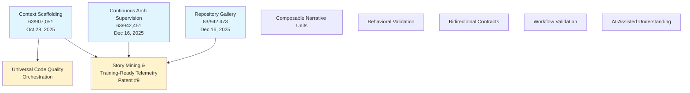

# Patent family tree

Principal AI's **10 patent applications** form a family tree with **Context Scaffolding** (provisional 63/907,051, filed Oct 28, 2025) as the foundational patent. Several later patents claim benefit of this provisional and other related applications.

## Visual Family Tree

```
Context Scaffolding System (ROOT)
├─ Provisional: 63/907,051
├─ Filed: Oct 28, 2025
└─ Children claiming benefit:
   │
   ├─── Universal Code Quality Orchestration
   │    └─ Claims benefit of 63/907,051
   │
   └─── Story Mining & Training-Ready Telemetry (Patent #9)
        └─ Claims benefit of:
           ├─ 63/907,051 (Context Scaffolding)
           ├─ 63/942,473 (Repository Gallery)
           └─ 63/942,451 (Continuous Arch Supervision)

Continuous Architectural Supervision
├─ Provisional: 63/942,451
├─ Filed: Dec 16, 2025
└─ Referenced by Patent #9

Repository Gallery System
├─ Provisional: 63/942,473
├─ Filed: Dec 16, 2025
└─ Referenced by Patent #9

Standalone Patents (no priority claims found in documents):
├─ Composable Narrative Unit Architecture
├─ Runtime Log-Driven Architectural Animation and Behavioral Validation
├─ Bidirectional Contracts (Patent #7)
├─ Workflow Validation
└─ AI-Assisted Architecture Understanding
```

## Mermaid Diagram



## Patent Families

### Family 1: Context Scaffolding Line
**Root:** Context Scaffolding System (63/907,051)

**Direct children:**
- Universal Code Quality Orchestration
- Story Mining & Training-Ready Telemetry (also claims 63/942,473, 63/942,451)

### Family 2: Convergent Patent (Story Mining)
**Story Mining & Training-Ready Telemetry** claims benefit of THREE provisionals:
1. 63/907,051 (Context Scaffolding)
2. 63/942,473 (Repository Gallery)
3. 63/942,451 (Continuous Arch Supervision)

This is the **convergent patent** that unifies the scaffolding, gallery, and supervision concepts.

### Standalone Patents
The following patents appear to be filed independently (no priority claims documented):
- Composable Narrative Unit Architecture
- Runtime Log-Driven Architectural Animation and Behavioral Validation
- Bidirectional Contracts (Patent #7)
- Workflow Validation
- AI-Assisted Architecture Understanding

**Note:** These may have priority claims not visible in the reviewed documents, or they may be genuinely standalone inventions filed fresh.

## Timeline

```
Oct 28, 2025
└─ Context Scaffolding (63/907,051) ← ROOT PATENT

Dec 16, 2025
├─ Continuous Arch Supervision (63/942,451)
└─ Repository Gallery (63/942,473)

Feb 2026
├─ Story Mining (Patent #9) - claims all three above
├─ Bidirectional Contracts (Patent #7)
├─ Behavioral Validation
├─ Workflow Validation
├─ Universal Code Quality Orchestration - claims 63/907,051
├─ Composable Narrative Units
└─ AI-Assisted Understanding
```

## Strategic Notes

**Context Scaffolding as foundation:**
The earliest provisional (63/907,051, Oct 28, 2025) serves as the foundation patent, with at least two confirmed children claiming priority. This creates a defensive moat around the core "pre-computed expert context" concept.

**Story Mining as convergent point:**
Patent #9 (Story Mining & Training-Ready Telemetry) is the only patent documented to claim benefit of THREE provisionals, making it the convergent point that unifies scaffolding, gallery, and supervision concepts into the "expert reasoning as training data" asset.

**Publication timeline:**
Non-provisional applications typically publish 18 months after earliest priority date:
- 63/907,051 → Publishes ~April 2027
- 63/942,451, 63/942,473 → Publish ~June 2027
- Feb 2026 patents → Publish ~August 2027

Competitors won't see the full family tree until 2027 publications.

## Updates

- **2026-06-22** — Patent family tree mapped from filed documents. Context Scaffolding (63/907,051) confirmed as root patent with at least 2 children. Story Mining (Patent #9) confirmed as convergent patent claiming benefit of 3 provisionals. 5 patents appear standalone (no documented priority claims).
